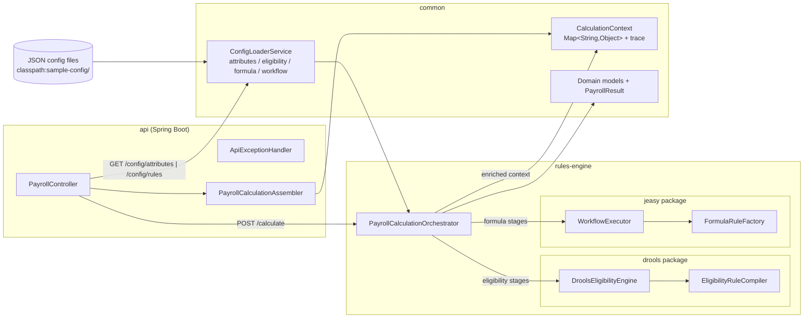

# payroll-calc-engine

A Gradle-based **modular-monolith** Spring Boot 3.x application that calculates
employee pay — from hourly + activity-based components through to final net
compensation — using **two rule engines working together**:

- **Drools (KIE)** handles *eligibility* and *classification* rules: which pay
  components apply to this employee, which tax slab applies, which thresholds
  matter. This is pattern-matching over interdependent conditions, well suited
  to the Drools Rete algorithm and decision-table-style rules.
- **jEasy** handles *calculation/formula* execution: given that a component
  applies, compute its value. jEasy rules map cleanly to an ordered sequence of
  `condition + formula` steps.

Everything — attributes, eligibility rules, formulas, and workflow ordering —
is sourced from external **JSON config files**, loaded and compiled at runtime.
There are **no static `.drl` files and no hardcoded business logic in Java**:
every number in a `PayrollResult` traces back to the JSON configuration.

This is **MVP1**: JSON-driven only, no database, no persistence, a stateless
calculation API, built in anticipation of a future **low-code UI** that will
edit these same JSON files — the config structures are kept clean enough to be
exposed via a read API (`GET /api/v1/payroll/config/*`).

---

## Table of contents

1. [Modules](#modules)
2. [Architecture](#architecture)
3. [Why Drools and why jEasy](#why-drools-and-why-jeasy)
4. [The tax-slab circular dependency](#the-tax-slab-circular-dependency)
5. [JSON configuration schema](#json-configuration-schema)
6. [Build, test and run](#build-test-and-run)
7. [API usage](#api-usage)
8. [Roadmap](#roadmap)

---

## Modules

| Module         | Package root              | Responsibility                                                          |
|----------------|---------------------------|------------------------------------------------------------------------|
| `common`       | `com.payroll.common`      | Domain models, JSON config schema, `ConfigLoaderService` (load + validate) |
| `rules-engine` | `com.payroll.rulesengine` | Drools eligibility engine, jEasy calculation engine, orchestrator       |
| `api`          | `com.payroll.api`         | Spring Boot REST layer (`/api/v1/payroll/**`), validation, error handling |

Dependency direction is strictly **`api` → `rules-engine` → `common`**.

---

## Architecture



The calculation flow for one request:

1. `PayrollController` validates the request DTO and `PayrollCalculationAssembler`
   maps it into a `CalculationContext` (a plain `Map<String,Object>` of facts).
2. `PayrollCalculationOrchestrator` iterates `workflow.json` stages **in order**.
3. `ELIGIBILITY` stages are dispatched to `DroolsEligibilityEngine`
   (compiled once into a cached `KieBase`; a fresh `KieSession` per request).
4. `FORMULA` stages are dispatched to `WorkflowExecutor` (jEasy), which runs
   each stage's rules in priority order against the same attribute map.
5. Final attributes are mapped into a `PayrollResult` with itemized
   `PayComponent`s and a full `calculationTrace`.

**Decoupling guarantee:** the `drools` and `jeasy` packages never reference each
other. Only the orchestrator knows both engines.

---

## Why Drools and why jEasy

| Concern                        | Engine | Why                                                                 |
|--------------------------------|--------|---------------------------------------------------------------------|
| Eligibility / classification   | Drools | Interdependent conditions (`FULL_TIME && grade > 3`, `activityType IN [...] && units > 0`) are pattern-matching over working-memory facts. The Rete algorithm shares condition evaluation across rules and scales as more rules are added. DRL is generated at runtime from JSON — no static `.drl`. |
| Formula execution              | jEasy  | Each formula is a self-contained `condition -> action` step (`BASE_PAY`, `OVERTIME_PAY`, …). jEasy evaluates a priority-sorted `Rules` set with re-evaluation of conditions as facts change, which maps 1:1 onto the JSON `formula-rules.json` entries and the ordered stages of `workflow.json`. |

**Engine version notes**

- Drools `9.44.0.Final` (`kie-ci`, `drools-core`, `drools-mvel`, `drools-compiler`).
- jEasy: the brief requested "jEasy 6.x (`jeasy-rules-core`, `jeasy-rules-mvel`)",
  but **no 6.x release exists** on Maven Central or the `j-easy/easy-rules`
  GitHub repository. The latest published version is **4.1.0** under the real
  coordinates `org.jeasy:easy-rules-core` and `org.jeasy:easy-rules-mvel`, and
  that is what is used here.

---

## The tax-slab circular dependency

**Problem:** tax slab classification depends on *gross pay*, but gross pay is
only known after the earning formulas run. Naively classifying the slab at the
start (before `grossTotal` exists) is impossible; hiding the fix in ad-hoc Java
logic would violate the "everything config-driven" rule.

**Decision (resolved explicitly in config):**

`workflow.json` is a two-pass pipeline. `GROSS_TOTAL` is computed as a normal
jEasy **formula** stage first; immediately after it, a **second, lightweight
Drools eligibility stage** named `TAX_SLAB_DETERMINATION` classifies the slab
from `grossTotal` and writes `taxSlab`/`incomeTaxRate`; only then do the
slab-dependent `STATUTORY_DEDUCTIONS` run:

```text
BASE_PAY -> OVERTIME -> ACTIVITY_PAY -> ALLOWANCES
   -> GROSS_TOTAL                 (formula: grossTotal now known)
   -> TAX_SLAB_DETERMINATION      (Drools: slab from grossTotal)
   -> STATUTORY_DEDUCTIONS        (formula: incomeTax = grossTotal * incomeTaxRate)
   -> NET_PAY
```

Each workflow stage declares its `engine` (`ELIGIBILITY` or `FORMULA`) and the
exact `ruleIds` it runs. The orchestrator simply walks the stages and dispatches
per `engine`, so the ordering lives in JSON — not in Java. The per-stage
`ruleIds` are also used as a Drools `AgendaFilter`, so a stage fires only its
own rules.

---

## JSON configuration schema

Config location is configurable via `payroll.config.location`
(default `classpath:sample-config/`; file-system paths also supported). All four
files are loaded once at startup and **cross-validated** by
`ConfigLoaderService`: unknown `ruleId`s in a workflow stage, undeclared
attribute references, duplicate ids and malformed `BETWEEN`/`IN` values fail
fast with an actionable message naming the offender — the application refuses to
start rather than failing at request time.

### 1. `attributes.json` — the attribute dictionary

Every fact the engines may read or write, its type, source and default value.

```jsonc
{
  "attributes": [
    {
      "id": "hourlyRate",            // canonical name used in conditions/formulas and contexts
      "displayName": "Hourly Rate",  // human label for the future low-code UI
      "dataType": "NUMBER",          // NUMBER | STRING | BOOLEAN
      "source": "EMPLOYEE_MASTER",   // EMPLOYEE_MASTER | ATTENDANCE | ACTIVITY | COMPUTED
      "defaultValue": 0              // applied when the request omits the attribute
    }
    // ...
  ]
}
```

Covered scenario (27 attributes): `hourlyRate`, `standardHours`, `overtimeHours`,
`overtimeMultiplier`*, `employeeGrade`, `employmentType`, `activityType`,
`activityUnits`, `activityUnitRate`, `transportAllowance`, `mealAllowance`,
`providentFundRate`; computed flags `overtimeEligible`, `activityBonusEligible`,
`taxSlab`, `incomeTaxRate`; and computed outputs `basePay` … `netPay`.

> `*overtimeMultiplier` is a schema addition over the original brief: it keeps
> the 1.5x overtime factor in config so every formula operand stays
> `BigDecimal` (MVEL would otherwise coerce a bare `1.5` literal to `double`).
>
> All computed numeric outputs default to `0` (not `null`) so every attribute a
> formula references always exists — MVEL 2.5.x throws on unresolved
> identifiers and its `?:` operator only works on booleans, so "absent component"
> is modelled as "stays at its zero default" instead of elvis-defaulting.

### 2. `eligibility-rules.json` — Drools rules

Compiled to DRL at runtime. Each rule lists `attribute/operator/value` condition
triples and the derived facts to set when all match.

```jsonc
{
  "rules": [
    {
      "ruleId": "RULE_OVERTIME_ELIGIBLE",
      "description": "Full-time employees at grade 4 or above qualify for overtime premium pay.",
      "conditions": [                                    // all conditions must match (AND)
        { "attribute": "employmentType", "operator": "EQUALS", "value": "FULL_TIME" },
        { "attribute": "employeeGrade",  "operator": "GREATER_THAN", "value": 3 }
      ],
      "derivedFacts": { "overtimeEligible": true }       // written into the context + trace
    }
    // ...
  ]
}
```

Operators: `EQUALS`, `NOT_EQUALS`, `IN` (array value), `GREATER_THAN`,
`LESS_THAN`, `BETWEEN` (two-element inclusive array value). Rules covered:
overtime eligibility (`FULL_TIME` + grade), activity-bonus eligibility
(activity type `IN [DELIVERY, SALES_UNIT, PIECEWORK]` + units), and three
tax-slab classifications (`SLAB_1 ≤ 1200`, `SLAB_2 1200.01–4000`, `SLAB_3 > 4000`).

### 3. `formula-rules.json` — jEasy rules

Each rule has a MVEL condition, a MVEL formula, an `outputAttribute` and an
optional `componentType` (only line items carry `EARNING`/`DEDUCTION`;
aggregate rules leave it out).

```jsonc
{
  "rules": [
    {
      "ruleId": "RULE_OVERTIME_PAY",
      "name": "Overtime Pay",                 // PayComponent display name
      "description": "Premium pay at the configured multiplier for eligible overtime hours.",
      "priority": 2,                          // execution order within its stage
      "condition": "overtimeEligible == true && overtimeHours > 0",   // MVEL
      "formula": "hourlyRate * overtimeHours * overtimeMultiplier",   // MVEL
      "outputAttribute": "overtimePay",       // result is written here (BigDecimal, 2dp)
      "componentType": "EARNING"              // EARNING | DEDUCTION, or omitted for aggregates
    }
    // ...
  ]
}
```

Each fired rule appends a readable line to the audit trace, e.g.
`RULE_OVERTIME_PAY: hourlyRate(25.00) * overtimeHours(4) * overtimeMultiplier(1.5) = 150.00`.

### 4. `workflow.json` — ordered stages

```jsonc
{
  "stages": [
    {
      "name": "INITIAL_ELIGIBILITY",           // first Drools pass
      "engine": "ELIGIBILITY",
      "ruleIds": ["RULE_OVERTIME_ELIGIBLE", "RULE_ACTIVITY_BONUS_ELIGIBLE"],
      "execution": "SEQUENTIAL"
    },
    {
      "name": "BASE_PAY",                      // formula stage
      "engine": "FORMULA",
      "ruleIds": ["RULE_BASE_PAY"],
      "execution": "SEQUENTIAL"
    }
    // GROSS_TOTAL -> TAX_SLAB_DETERMINATION (2nd Drools pass) -> STATUTORY_DEDUCTIONS -> NET_PAY
  ]
}
```

> `engine` per stage is a schema addition over the brief: it is how the
> two-pass slab resolution above is expressed in config. `SEQUENTIAL` vs
> `PARALLEL`: easy-rules 4.x removed rule groups (`UnitRuleGroup`/
> `ActivationRuleGroup`), so sequential ordering is enforced by rule priority
> inside a stage's priority-sorted `Rules` set; `PARALLEL` only guarantees the
> rules in the stage are independent.

---

## Build, test and run

Requirements: JDK 21 (toolchain).

```bash
./gradlew build          # compiles all three modules
./gradlew test           # runs common + rules-engine + api tests (exact-value pay assertions)
./gradlew bootRun        # starts the API on http://localhost:8080
```

Open **Swagger UI**: <http://localhost:8080/swagger-ui.html>
(OpenAPI JSON at <http://localhost:8080/v3/api-docs>).

Config can be pointed at a different directory:

```bash
./gradlew bootRun -Dspring-boot.run.arguments=--payroll.config.location=classpath:sample-config/
```

### curl examples (the three sample employees)

Full-time with overtime — **gross 1375.00, net 1117.50**:

```bash
curl -s -X POST http://localhost:8080/api/v1/payroll/calculate \
  -H "Content-Type: application/json" \
  -d @api/src/test/resources/samples/full-time-overtime.json
```

Part-time, no overtime — **gross 400.00, net 400.00**:

```bash
curl -s -X POST http://localhost:8080/api/v1/payroll/calculate \
  -H "Content-Type: application/json" \
  -d @api/src/test/resources/samples/part-time-no-overtime.json
```

Activity-based contractor — **gross 1250.00, net 1125.00**:

```bash
curl -s -X POST http://localhost:8080/api/v1/payroll/calculate \
  -H "Content-Type: application/json" \
  -d @api/src/test/resources/samples/activity-based-contractor.json
```

Ready-to-run `.http` versions of all three live in
[`docs/sample-requests.http`](docs/sample-requests.http).

---

## API usage

| Method | Path                                  | Description                                      |
|--------|---------------------------------------|--------------------------------------------------|
| POST   | `/api/v1/payroll/calculate`           | Run the full Drools + jEasy pipeline              |
| GET    | `/api/v1/payroll/config/attributes`   | Attribute dictionary (read-only, for low-code UI) |
| GET    | `/api/v1/payroll/config/rules`        | Loaded eligibility + formula rules (read-only)    |

**Responses**

- `200` — `PayrollResult` (employeeId, period, itemized components,
  `grossPay`/`totalDeductions`/`netPay` as `BigDecimal`, full `calculationTrace`).
- `400` — Bean Validation failure or malformed body (structured `ApiError`,
  no stack traces).
- `422` — rule-evaluation failure (`EligibilityEvaluationException` /
  `FormulaEvaluationException` carrying `ruleId`/`outputAttribute`).
- `500` — unexpected error (stack trace logged server-side only).

**Money discipline:** every monetary field in this codebase is `BigDecimal` —
never `double`/`float`. The formula engine also rounds every output to 2
decimal places (`HALF_UP`) so responses are exact to the cent.

---

## Roadmap (post-MVP1)

- **Low-code rule editor UI** that reads the JSON config through
  `GET /api/v1/payroll/config/*` and writes the same files back (schema is
  designed for this).
- Validation-tool integration: reuse `ConfigLoaderService` to pre-validate
  edited config before hot-reloading it.
- Persistence for employees/attendance (currently the API is stateless;
  every calculation ships its own input data).
- Authentication/authorization on the API.
- Multi-activity employees (per-activity aggregation), currently MVP1 treats
  the first activity record as the activity source.